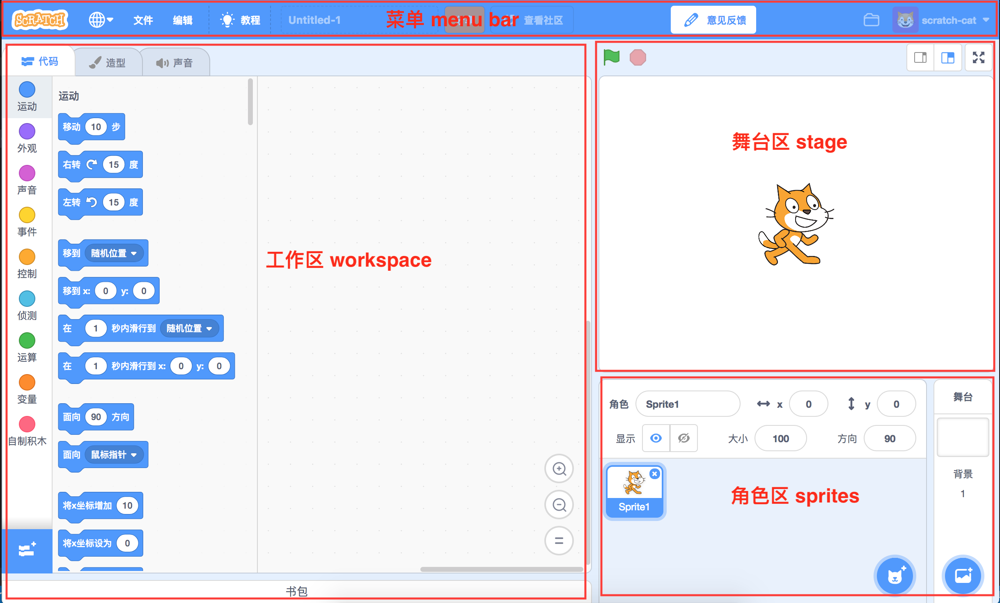

# scratch 3.0 学习笔记

### scratch3.0 几个核心库介绍

### [scratch-gui](https://github.com/LLK/scratch-gui)

由 React 组件实现的的 UI 界面

大概布局和功能
+ 菜单：
    + 多语言切换
    + 项目导出和导入（*支持导入scatch2的项目*）
    + 切换加速模式（*加速模式会木块执行更快，因为它不会等待角色渲染*）
    + 教程
    + 编辑项目名称
    + 查看社区
    + 注册（登陆后是查看我的项目列表）
    + 登陆（登陆后是用户信息）
+ 工作区
    + 代码：使用积木块操作舞台角色
    + 造型：添加或编辑角色的造型图片，支持上传svg、png、jpg等图片，以及摄像头
    + 声音：添加或编辑角色的声音，支持上传mp3、wav的声音，以及录音
    + 扩展：可以添加额外的积木分类，目前开放的有：音乐、画笔、谷歌翻译、视频侦测等
+ 舞台区
    + 绿旗：触发运行工作区中的绿旗积木块
    + 停止：停止所有运行中的积木（*如果你用了【当响度>10】这样的事件块时，停止后会可能会被再次触发*）
    + 放大、缩小、全屏：调整舞台大小
    + 舞台：使用 webgl 渲染背景、角色
    + 其他：显示勾选的变量、列表、侦测值，问答交互
+ 角色区：
    + 显示、设置角色的信息：角色名、坐标、显示隐藏、大小、方向
    + 添加到舞台的角色列表：
        + 调整顺序
        + 删除角色
        + 复制角色
        + 导出角色（会将角色的声音、造型、积木一起导出为一个 .sprite3 文件）
        + 将积木、声音、造型拖拽分享到其他角色
    + 添加角色和背景：支持上传图片和 .sprite3 文件

### [scratch-blocks](https://github.com/LLK/scratch-blocks)

Scratch Blocks 是基于谷歌 [Blockly](https://github.com/google/blockly) 开发的一个图形化 js 库，用积木块的形式来实现编程。

这里 Scratch Blocks 抛弃了 Blockly 中积木块转 Python 等编程语言的功能（Blockly中Generator 的部分），通过抛事件的方式搭配 Scratch VM 来实现控制舞台渲染。

### [scratch-vm](https://github.com/LLK/scratch-vm)

Scratch VM 是一个运行 Scratch Blocks 代码块的引擎库。主要有以下功能：

+ 加载解析项目：通过 Scratch GUI 导入一个 .sb2、.sb3 的项目文件，解析项目文件，加载项目中用到的图片和声音，将项目角色渲染到舞台上，将项目中用到的积木块渲染到代码工作区。
+ 导出项目：将当前项目中的角色图片、声音、积木等项目信息和资源打包压缩成 .sb3 文件
+ 解析运行积木：
    + 定义每种类型积木执行时的方法
    + 通过监听代码工作区的事件，保存当前角色代码工作区对应的积木代码信息
    + 角色切换时，根据这些积木信息将该角色的积木块还原到工作区
    + 不断检测代码块的状态，在代码块被触发运行时，解析代码块信息，执行代码块对应的方法，更新舞台角色状态
+ 扩展管理：扩展被添加时，解析扩展数据，更新 Scratch Blocks 的 toolbox ，添加新的分类和积木
+ 调用 Scratch Render 提供的渲染接口，更新舞台

### [scratch-render](https://github.com/LLK/scratch-render)

Scratch Render 是基于 webgl 的一个渲染引擎，主要用到了 twgl 库，定义了供 Scratch VM 调用的接口。
主要功能：
    + 根据 svg、png 的数据在 canvas 中渲染成图形
    + 更新角色图层的信息：大小、位置、角度、图层优先级、图形特效等
    + 画笔图层

### [scratch-audio](https://github.com/LLK/scratch-audio)

Scratch Audio 是用来解析声音、播放声音的库。

### [scratch-link](https://github.com/LLK/scratch-link)

Scratch Link 通过 WebSocket 使 Scratch 硬件扩展可以和硬件设备通讯。

想知道怎么用 nodejs 实现，可以查看 https://github.com/Micircle/scratch-node-link。

### 其他仓库
[scratch-paint](https://github.com/LLK/scratch-paint)：GUI 中造型编辑的组件，用到了 paper.js，目前处理带有 text 标签的 svg 文件时会有 bug，在 windows 环境中容易崩溃。

[scratch-svg-render](https://github.com/LLK/scratch-svg-render)：scratch 处理 svg 资源的一个工具库，处理带有 text 标签的 svg 文件时会有 bug。

[scratch-i10n](https://github.com/LLK/scratch-i10n)：scratch 多语言库，包含了Scratch GUI 和 Scratch Blocks 中用到的翻译信息。

### 笔记目录
- [Scratch Gui](./scratch-gui/index.md)
- [Scratch Blocks](./scratch-blocks/index.md)
- [以 microbit 扩展为例，了解 Scratch 硬件通讯流程](https://github.com/Micircle/scratch-node-link)

*喜欢的话请点击一下右上角的 Star 吧，谢谢~*
