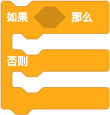
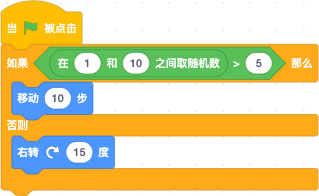

# 了解 Block

打开 [Scratch3.0](https://scratch.mit.edu/projects/editor/) 查看左侧的积木，会发现每个分类的积木颜色、形状、组成各有异同。他们形状不同代表了什么区别呢？一个积木块上面有又一些不一样的元素组成，这些元素是什么？我怎么能定义一个我自己的积木呢？

这些问题接下来会一一说明。

### Block 的形状与功能

| UI 形状 | 类型 | 功能 |
--|--|--
 | 命令类型 Command | 执行一条命令
 | 数值或字符串类型 Number or String | 读取一个数值或字符串
 | 布尔类型 Boolean | 返回 True 或 False
 | 事件类型 Event (也被叫做 帽子块 hat) | 监听一个事件
 | 条件类型 Condition | 根据条件的结果，执行不同的分支
 | 按钮 Button | 就是按钮的功能，可以添加一个点击后的回调事件

我们会看到有的积木上也有一些形状跟数值、字符串和布尔类型的积木形状类似，而我们也可以把他们嵌入到对应形状的积木里，就像我们也可以把命令型的积木嵌入到条件类型的积木里面一样。如图：



这是因为这些位置也是一种特殊的 block，被称为 shadow block，与 XML 对应的有些积木里有 shadow 标签，如：
```html
<block type="motion_movesteps">
    <value name="STEPS">
        <shadow type="math_number">
            <field name="NUM">10</field>
        </shadow>
    </value>
</block>
```
这种 shadow block 是作为一个参数呈现在另一个 block 中的，它接受与他相同返回值类型的 block 覆盖它。

### Block 的组成元素

block 是通过 XML 代码来定义结构的：
- block 标签：积木，type 是他的标识符（也被称作 opcode），需要与他的定义名称相对应。在 mainWorkspace 中将积木转化成 XML （可以常看上一章内容）你还会发现他有一些其他属性，比如 id、x、y 等。
- value 标签：是指 block 的一个参数，参数的名字就是 value 标签的 name 属性，也会和积木定义的参数相对应。
- shadow 标签：阴影积木，type 属性是引用的已定义的其他 block 的 type。
- field 标签：block 的最小组成单元，name 属性值需要时已经定义好的 Field 类型。在 XML 中 field 标签可以不写，除非需要修改在积木上显示的默认值。

### Block 的定义

继续以 motion_movesteps 为例：

```javascript
import ScratchBlocks from 'scratch-blocks';
// 将 'motion_movesteps' 添加到 ScratchBlocks.Blocks 对象中，这个对象包含了所有积木的定义
ScratchBlocks.Blocks['motion_movesteps'] = {
    // 积木初始化时调用的方法
    init: function() {
        // 积木的 json 配置
        this.jsonInit({
            // 积木标识符，如果和 ScratchBlocks.Blocks['motion_movesteps'] 中的一致，可以省略不写
            "type": "motion_movesteps",
            // 积木的文案，1% 是参数占位符，和 args0 数组中参数对应
            "message0": '移动 %1',
            // 积木的参数，必须是数组，可以为空数组，
            "args0": [
                {
                    // 参数类型，input_ 开头表示包含了一个 shadow block
                    // 需要在 xml 中指明 shadow block 的 type
                    "type": "input_value",
                    // 参数的名称
                    "name": "STEPS"
                }
            ],
            // 积木所属的分类，对应 xml 中 category 标签的 id
            "category": 'motion',
            // 积木继承项，数组中的字符串是已经定义好的扩展，使用扩展属性可以减少重复的配置
            // 可以在 ScratchBlocks.Extensions 对象中查看所有定义的扩展，也可以自己定义扩展。
            // colours_motion 表示 motion 积木的颜色
            // shape_statement 表示积木的形状
            "extensions": ["colours_motion", "shape_statement"]
        });
    }
};
```
除了 ```message0```、 ```args0``` 还可以有 ```message1```、 ```args1```等，表明这个积木是多行的，如 if-else 的定义：


```javascript
import ScratchBlocks from 'scratch-blocks';
ScratchBlocks.Blocks['control_if_else'] = {
    init: function() {
        this.jsonInit({
            "type": "control_if_else",
            // 积木如果要支持多语言，就需要用 ScratchBlocks.Msg 对象来设置 message
            "message0": ScratchBlocks.Msg.CONTROL_IF, // zh: 如果 1% 那么
            "message1": "%1",
            "message2": ScratchBlocks.Msg.CONTROL_ELSE, // zh: 否则
            "message3": "%1",
            "args0": [
                {
                    "type": "input_value",
                    "name": "CONDITION",
                    "check": "Boolean"
                }
            ],
            "args1": [
                {
                    "type": "input_statement",
                    "name": "SUBSTACK"
                }
            ],
            "args3": [
                {
                    "type": "input_statement",
                    "name": "SUBSTACK2"
                }
            ],
            // 分类也用 ScratchBlocks.Categories 对象来设置，避免不一致
            "category": ScratchBlocks.Categories.control,
            "extensions": ["colours_control", "shape_statement"]
        });
    }
};
```
如果想为积木设置其他的颜色那么可以在 json 中配置 ```colour, colourSecondary, colourTertiary``` 属性。

如果想自定义积木的形状可以配置 ```output, outputShape, previousStatement, nextStatement``` 属性。

积木中 args 的 type 属性可以是已定义的 input 类型或 field 类型，input 类型的参数是对应了一个 shadow block，通常在 UI 上可以被相同形状的积木覆盖。

常用到的 fields 和 inputs：
- Fields:
    - field_dropdown: 下拉列表
    - field_checkbox: 勾选框
    - field_colour: 颜色
    - field_number: 数字输入
    - field_angle: 角度选择
    - field_variable: 变量
    - field_date: 日期
    - field_label: 标签文本，通常根据 message 直接生成
    - field_image: 图片文本

- Inputs:
    - input_value：可被相同形状的积木覆盖的参数，根据 ```"check": "Boolean", "String", "Number" ``` 的不同，形状不同
    - input_statement：可以连接命令类型积木

更为详细的可以查看官方的文档 [Define Blocks](https://google-developers.appspot.com/blockly/guides/create-custom-blocks/define-blocks)。

### 示例
- [定义一个分类的积木](../src/examples/define-block.html)