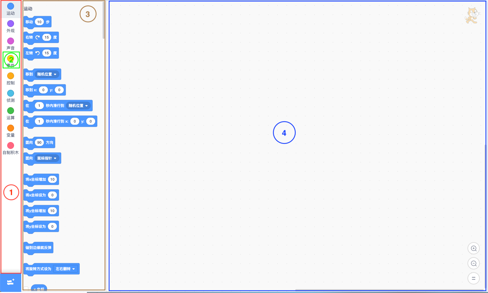

# Scratch Blocks 关键对象
我们先从 UI 上来了解 Scratch Blocks 界面的组成：



### Toolbox
红色框住的部分叫做 Toolbox，用来展示所有的积木分类，会根据用户的选择显示某个选中分类下的所有积木。
### Category
红色框中绿色部分表示一个分类 Category，Scratch Blocks 中默认有运动 Motion、外观 Looks、声音 Sound、事件 Events、控制 Control、侦测 Sensing、运算 Operators、变量 Variables、自制积木 My Blocks，还可以通过添加扩展来添加新的积木分类。每个分类都对应着若干积木块。分类可以被用户选中，被选中后该分类下的积木就会被显示出来。
### Flyout
棕色框则是 Flyout，是分类被选中后呈现积木的容器（其实是 flyoutWorkspace 的容器），其中一个个蓝色的块就是积木块 Block，每个 Block 就是 Scratch 中一个独立的程序方法。
### Workspace
最大面积蓝色框是 mainWorkspace，是 Workspace 的一个实例，之所以称 mainWorkspace，是因为他并不是 Workspace 唯一的实例，Flyout 中同样有一个实例称为 flyoutWorkspace。Workspace 可以理解为是 Blocks 的容器。flyoutWorkspace 中的 Block 只能拖出，却不能自由拖动改变位置，拖出到 mainWorkspace 中即表示创建了一个新的 Block；mainWokrspace 中的 Block 可以自由拖动位置，当被拖到 Flyout 或 Toolbox 上方式表示即将被删除。我们通常的操作就是从 flyoutWorkspace 中拖出积木放到 mainWorkspace 中去自由的编辑组合。

Toolbox、Category、Flyout、Workspace、Block，是我们从 UI 中第一眼看到的 Scratch Blocks 的一部分重要对象，细心地还可以发现 flyoutWorkspace 和 mainWorkspace 都有的滚动条 Scrollbars，在 mainWorkspace 中是既有竖向的也有横向的，而 flyoutWorkspace 中只有一个竖向的。还可以看到右下角有三个按钮他们属于 ZoomControls，分别用来放大、缩小、还原 mainWorkspace 中的积木大小。

然而我们在浏览器上看到的都是一个个渲染好的 Dom 节点，一个个分类 Category 是 div + span，而 Flyout、Workspace、Scrollbars 则是一个个的 svg，Blocks 则是有各种 svg 元素 g、path、text 等组成。那么这些节点是怎么渲染的呢？

### Xml
负责将 XML 文档解析成 DOM 节点，将 DOM 代表的积木渲染到 Workspace 上。还可以将Workspace 中的 Blocks 转化成 XML 字符串。简单的代码示例如下：

xml 字符串渲染成积木
```javascript
    // 一个 xml 字符串，包含若干个 block
    const xmlText = '<xml><block type="motion_xposition" /></xml>';
    // 通过方法转化成了浏览器的 DOM 对象
    const xmlDom = Blockly.Xml.textToDom(xmlText);
    // 将 DOM 对象再解析成 block 渲染到目标 workspace 中，这时候就可以在浏览器上看到积木块了
    const blockIds = Blockly.Xml.domToWorkspace(xmlDom, Blockly.mainWorkspace);
```
获取 workspace 的 xml 字符串
``` javascript
    // 将 workspace 中的积木转化成 DOM 对象
    const xmlDom = Blockly.Xml.workspaceToDom(Blockly.mainWorkspace);
    // 将 DOM 对象转成 XML 字符串
    const xmlText = Blockly.Xml.domToText(xmlDom);
```

这也是 Scratch3.0 中角色切换，工作区积木也会跟着切换的原理，这点会在之后再补充说明。

我们从这里就可以看到 block 和 XML 文档中的 block 标签是有意义对应关系的，事实也是 Toolbox 中的所有分类 Category 和积木 Block 对应了一个完整的 XML 树，这个 XML 可以在 [Scratch Gui](https://github.com/LLK/scratch-gui/blob/develop/src/lib/make-toolbox-xml.js) 项目的 `src/lib/make-toolbox-xml.js` 中找到，如果你对这个 js 里 category、block 标签的结构有些其奇怪，或者在想是不是可以随便定义一个 category、block 就可以在浏览器上显示出来，那么可以后边的章节，看看 Block 是有什么构成的，怎么自己定义一个 Block 和 Category。

Scratch Blocks 中还有很多重要的属性和方法，后边的内容也会涉及到一部分，<strong style="color: #1EAAFF">如果你遇到了一些问题或者有任何建议都可以在 Issues 中留言，我会最快的响应</strong>。

*喜欢的话请点击一下右上角的 Star 吧，谢谢~*