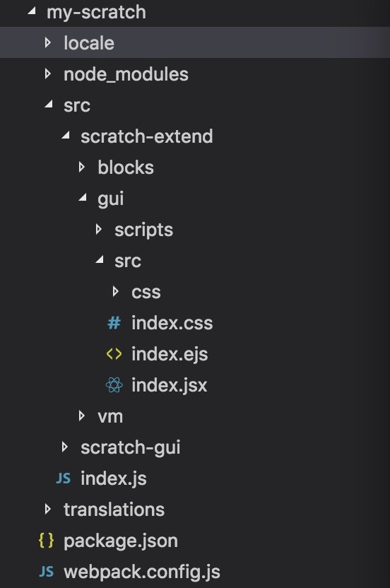

# scratch-gui

[scratch-gui](https://github.com/LLK/scratch-gui) 是创建和运行Scratch 3.0网站的开元仓库。

## 本地开发目录配置

因为scratch-gui正在持续的开发更新，为方便项目的迭代，不建议直接在源码中进行修改。

先创建一个本地项目，如my-scratch，将scratch-gui的代码从github中clone到本地，再并列创建一个extend文件，用来对scratch项目源代码进行扩展和修改，主要是scratch-gui、scratch-blocks和scratch-vm三个库。

将scratch-gui目录下的package.json和webpack.config.js拷贝到my-scratch目录下，修改相关路径配置，具体请查看这个两个文件内容，然后执行npm install。

在对相关库文件进行扩展修改时，需要在scratch-extend目录下建立同样路径的文件，并对修改处做注释标记，方便后期源码更新后，对比升级。

项目路径如图：

