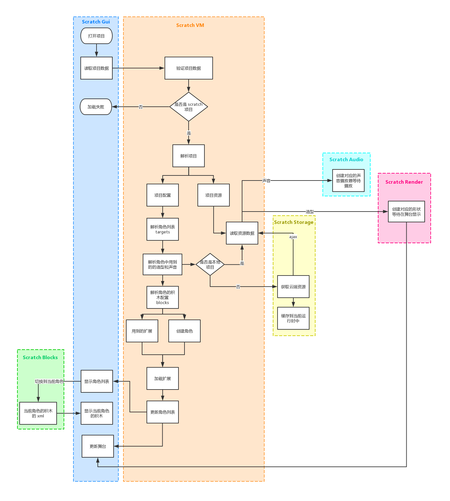

# 从 Scratch Gui 开始学习 Scratch3.0

Scratch Gui 是一个可以创建和运行 Scratch 3.0 项目的单页面应用。

下面简单介绍一下对 Scratch Gui 项目的理解。

本地启动 Scratch Gui 项目
```bash
> git clone https://github.com/LLK/scratch-gui.git
> cd scratch-gui
> npm i
> npm start
```
然后在浏览器中打开 http://0.0.0.0:8601 或者 http://localhost:8601/

有些权限如：麦克风、摄像头，需要 https 协议才可以使用。在本地使用则需要使用 http://localhost:8601/。

### webpack 配置简介
1. rules 中，jsx 的 babel-loader 包含了 node_modules 中的部分模块，尤其是 scratch- 相关的 npm 包。
    ```javascript
    {
        test: /\.jsx?$/,
        loader: 'babel-loader',
        include: [
            path.resolve(__dirname, 'src'),
            /node_modules[\\/]scratch-[^\\/]+[\\/]src/,
            /node_modules[\\/]pify/,
            /node_modules[\\/]@vernier[\\/]godirect/
        ]
    }
    ```
    通过这样设置，在 webpack 编译时直接编译 npm 包的源码，方便本地调试，可以通过 sourceMap 直接定位到准确文件位置。采用这种方式需要把相关库依赖的 npm 包安装到当前项目中，可以看到 ```scratch-gui/package.json devDependencies``` 中有非常多依赖项，但可能会导致首次编译速度比较慢。

2. runtimeChunk，将运行时的解析方法打包到一个 chunk 中，[webpack runtime 的概念](https://webpack.docschina.org/concepts/manifest/#runtime) &&  [optimization.runtimeChunk](https://webpack.docschina.org/configuration/optimization/#optimization-runtimechunk)

3. ```module.exports``` 导出的是一个数组，会在 webpack 运行时同时编译数组中的所有配置。[多种配置类型(configuration types)](https://webpack.docschina.org/configuration/configuration-types/)

4. 3 中所说的第二个配置文件是作为 library 的配置，[创建 library](https://webpack.docschina.org/guides/author-libraries/#%E5%88%9B%E5%BB%BA%E4%B8%80%E4%B8%AA-library)

### src 目录简介

- **components:** 组件目录，主要定义 UI 结构和样式和展示数据
- containers:** 对 components 中部分组件的封装，处理部分业务逻辑，不涉及样式
- **css:** 全局的样式配置
- **examples/extensions:** 扩展配置示例
- **lib:** 工具方法目录，供组件调用的一些模块和方法，其中以 `-hoc.jsx` 结尾的高阶组件，是为 UI 组件提供额外的功能方法
- **playground:** GUI 示例，有多种模式：积木模式(blocks-only)、舞台模式(player)、完整模式(render-gui)
- **reducers:** 组件 store 的初始状态 和 reducers
- **index.js:** 作为 library 打包的入口文件

### Scratch Gui 加载项目的流程
简要概括就是：通过 Scratch Gui 打开项目文件，Scratch VM 解析项目角色数据，其中声音文件和造型图片文件分别通过 Scratch Audio 和 Scratch Render 解析加载后等待被使用，解析用到的 blocks 和 扩展，最后生成项目的角色列表，更新 Scratch Gui，渲染舞台

上图只是简单描述下项目加载的流程，实际上每个库的作用都更为复杂。